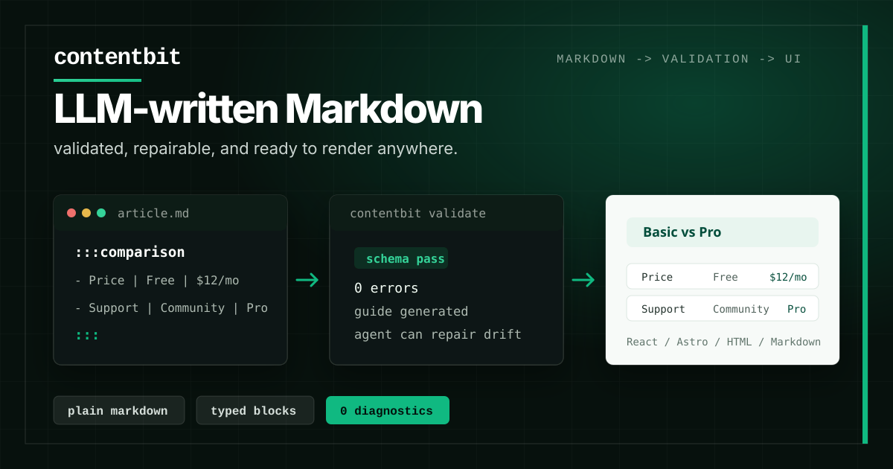

<p align="center">
  <a href="https://contentbit.dev">
    
  </a>
</p>

<p align="center">
  <a href="https://www.npmjs.com/package/contentbit"></a>
  <a href="https://www.npmjs.com/package/contentbit"></a>
  <a href="https://github.com/agonist/contentbit/actions/workflows/ci.yml"></a>
  <a href="https://nodejs.org">=22.18" /></a>
  <a href="https://pnpm.io"></a>
  <a href="./LICENSE"></a>
</p>

<p align="center">
  <a href="https://contentbit.dev/programmatic-seo">Programmatic SEO</a>
  ·
  <a href="https://contentbit.dev/docs">Docs</a>
  ·
  <a href="https://contentbit.dev/playground">Playground</a>
  ·
  <a href="https://contentbit.dev/blocks">Blocks</a>
</p>

# contentbit

**Open-source programmatic SEO toolkit for coding agents.**

Define reusable page families, brief writers and agents before they draft, and
validate content structure and internal links before publishing. Content stays
portable Markdown and renders in React, Astro, or plain Markdown.

- **Model page families** with required frontmatter, sections, blocks, and links.
- **Brief every page** before its Markdown file exists.
- **Give agents live rules** from the same contracts and block registry the CLI checks.
- **Enforce quality** with ranked Doctor findings and strict CI exit codes.
- **Publish anywhere** through React, Astro, or plain Markdown adapters.

## Quick Start

```bash
npx contentbit@latest init --seo
```

`init` detects your framework and package manager, installs the right packages,
creates the project and SEO configs, wires starter content and a rendered
`/example` page when possible, adds quality scripts, generates the live LLM
guide, and installs agent instructions. In Astro projects the example is
self-contained and leaves existing content collections untouched.

Plan a page, give the brief to a writer or agent, and run the publishing gate:

```bash
contentbit brief <key-or-slug>       # agent-ready writing contract
contentbit doctor --strict-seo       # content, structure, and link gate
pnpm run studio                      # preview briefs, pages, links, and findings
```

Or ask the installed coding-agent integration to run the loop:

```text
write the planned <page-key> page from its contentbit brief
```

Only need structured Markdown and rendering? Run `contentbit init` without
`--seo`.

For a production-shaped Astro implementation, use
[`astro-speedrun-seo`](https://github.com/agonist/astro-speedrun-seo). It is the
separate reference template for multilingual programmatic SEO, while the small
starters in this repository remain compatibility fixtures for package CI.

Prefer the pieces? Install the core packages and a renderer:

```bash
pnpm add @contentbit/core @contentbit/blocks @contentbit/react
```

## Why Contentbit

Programmatic content drifts when the plan lives in a spreadsheet, the writing
rules live in a prompt, and the quality checks happen during review. Contentbit
puts those rules in the codebase so humans, agents, Studio, and CI use the same
contract.

```ts
import { defineSeoConfig } from '@contentbit/core'

export default defineSeoConfig({
  pageTypes: {
    alternative: {
      requiredSections: ['Overview', 'Comparison', 'FAQ'],
      requiredBlocks: ['comparison'],
      recommendedBlocks: ['faq'],
      minOutgoingLinks: 2,
    },
  },
  pages: {
    'semrush-alternatives': {
      type: 'alternative',
      slug: 'semrush-alternatives',
      intent: 'commercial comparison',
      keywords: { primary: 'semrush alternatives' },
      linksTo: ['seo-tools-comparison'],
    },
  },
})
```

The page can be briefed before it exists. Once written, Doctor checks the live
file against the plan and reports exactly what needs repair.

## Structured Markdown underneath

Markdown remains the authoring format. Typed directive blocks add structure
where ordinary prose is not enough:

```md
:::comparison{left="Basic" right="Pro"}
- Price | Free | $12/mo
- Support | Community | Priority
:::
```

Every block has a schema. Invalid content fails with diagnostics a human or
model can fix:

```text
article.md:12:1 error CB_PROPS_INVALID
:::callout props invalid: type must be one of note|tip|warning|important|tldr.
hint: Did you mean type="warning"?
```

The same registry writes the authoring rules the agent sees, so custom blocks,
validation, docs, and prompts stay together.

## Agent Loop

After `init --seo`, your agent has a short, repeatable writing loop:

1. Read `contentbit.config.ts` for the content glob, registry, links, and SEO setup.
2. Run `contentbit brief <key-or-slug>` for the target page contract.
3. Run `contentbit instructions --audience llm` for the live block guide.
4. Write plain Markdown, using blocks only when the guide says they fit.
5. Run `contentbit doctor --strict-seo` and repair findings until it exits 0.

Refresh or add the integration at any time:

```bash
contentbit agents
```

The installed agent files hold no schemas. They read from the CLI at runtime, so
custom blocks are picked up automatically. See the
[LLM agents guide](https://contentbit.dev/docs/guides/agents).

## What You Get

| File or command       | Why it matters                                                     |
| --------------------- | ------------------------------------------------------------------ |
| `content/example.md`  | Starter content with built-in blocks and one custom block          |
| `blocks/registry.ts`  | Shared block schemas for validation, renderers, docs, and agents   |
| `contentbit.config.ts` | Shared content glob, registry, links, and SEO command defaults    |
| `contentbit.seo.config.ts` | Page-family contracts and plans for existing or future pages |
| `contentbit-guide.md` | Generated authoring rules for LLMs                                 |
| `AGENTS.md`           | Compact instructions for Codex, Cursor, Copilot, and other agents  |
| `.claude/skills/*`    | Claude Code author/audit skills when `.claude` is present          |
| `content:check`       | Validates content with the right glob and registry                 |
| `content:doctor`      | Ranks validation, link, thin-section, and image-alt issues         |
| `contentbit brief`    | Prints an agent-ready SEO brief for an existing or planned page    |
| `studio`              | Read-only browser for previews, stats, links, keywords, and health |
| `/example`            | Rendered route when the detected framework supports it             |

## Render Anywhere

contentbit treats structured Markdown as the portable content format. Use your
own prose pipeline for Markdown between blocks, then choose the surface:

- `@contentbit/react` for React components with headless accessible defaults.
- `@contentbit/astro` for `.astro` components with per-block overrides.
- `renderToMarkdown()` for plain Markdown fallbacks.

The styled React and Astro packs ship through a shadcn registry:

```bash
pnpm dlx shadcn@latest add @contentbit/generic-pack
```

Registry URL: `https://contentbit.dev/r/{name}.json`.

## Content Graph

Use frontmatter to declare relationships and let contentbit keep links honest:

```yaml
---
slug: beginner-pizza-dough
linksTo:
  - cold-fermentation-pizza
aliases:
  - intro-pizza-dough
---
```

`contentbit links "content/**/*.md"` builds `.contentbit/link-index.json` with
resolved links and backlinks. `contentbit validate` runs link checks when files
declare slugs, and `contentbit links --fix` can rewrite stale alias references.
Read the [internal linking guide](https://contentbit.dev/docs/guides/internal-linking).

## Programmatic SEO Contracts

Create `contentbit.seo.config.ts` with reusable page-type contracts and planned
pages, or let `contentbit init --seo` scaffold a starter. When that file exists,
`contentbit doctor` folds SEO contract findings into the normal repair plan,
Studio shows a read-only Brief view for each planned or existing page, and
`contentbit brief <key-or-slug>` prints the structure, links, required blocks,
and acceptance checks an agent should satisfy before publishing. See the
[programmatic SEO workflow](https://contentbit.dev/docs/guides/programmatic-seo).

Without an agent, the same loop is ordinary CLI-assisted writing: print the
brief, write the Markdown, run Doctor, inspect the page in Studio, and publish.

## Packages

| Package                                                                         | Purpose                                                        |
| ------------------------------------------------------------------------------- | -------------------------------------------------------------- |
| [`@contentbit/core`](https://www.npmjs.com/package/@contentbit/core)            | Parser, AST, diagnostics, registry, validation, Markdown output |
| [`@contentbit/blocks`](https://www.npmjs.com/package/@contentbit/blocks)        | Generic blocks: callout, steps, comparison, tabs, faq, and more |
| [`@contentbit/react`](https://www.npmjs.com/package/@contentbit/react)          | React renderer                                                 |
| [`@contentbit/astro`](https://www.npmjs.com/package/@contentbit/astro)          | Astro renderer                                                 |
| [`@contentbit/studio`](https://www.npmjs.com/package/@contentbit/studio)        | Local read-only content studio                                 |
| [`contentbit`](https://www.npmjs.com/package/contentbit)                        | CLI: init, validate, doctor, studio, stats, links, render       |

## Explore

- [Docs](https://contentbit.dev/docs) with live-rendered examples
- [All blocks](https://contentbit.dev/blocks) from the generic pack
- [Playground](https://contentbit.dev/playground) with live validation
- [Blog](https://contentbit.dev/blog) written as validated contentbit documents
- [Changelog](https://contentbit.dev/docs/changelog) for release notes
- [llms.txt](https://contentbit.dev/llms.txt) and the
  [authoring guide](https://contentbit.dev/contentbit-guide.md) for LLM context

## Development

```bash
pnpm install
pnpm -r build
pnpm -r test
pnpm lint && pnpm fmt:check
```

See [CONTRIBUTING.md](./CONTRIBUTING.md) for the repo layout and guidelines.

## License

[MIT](./LICENSE)
